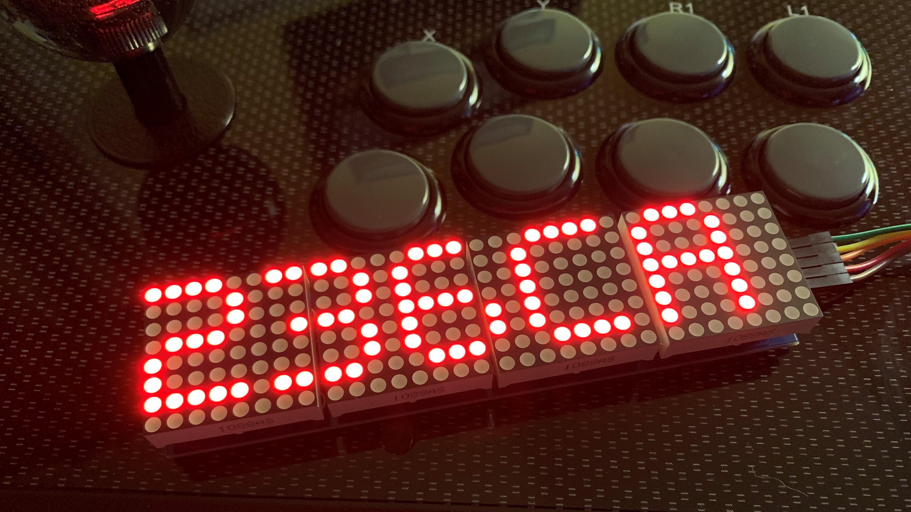

# 236C
236C is a small project utilizing the ESP32 and MAX7219 to create a dot matrix display for displaying inputs sent from a fightstick. The ESP32 communicates with the remote computer over wifi with a python script sending inputs to the ESP32 for displaying. 

### Setup Guide
This is a basic guide for getting set up quickly. There is much more in depth library documentation for further reading that will be linked at the end.
I won't go over basics such as uploading steps or how to install X, instead all relevant tutorlials will be linked at the end aswell.
This program could also be modified to run on an most microcontrollers with Wifi (TODO?).

#### Requirements
* Python 3
* Python inputs (pip install inputs)
* Arduino IDE/ PlatformIO / etc
* ESP32 Device
* MAX7219
#### Required Libraries
Add these to Arduino/PIO/project folder
* Adafruit BusIO
* Adafruit GFX Library
* MD_MAX72XX
* MD_Parola

#### ESP32 Setup
Wiring up the display is fairly straightforward with only 5 pins directly connected to headers on the board. The 5 pins are as follows: 
VCC, GND, DIN, CS, CLK.

You can define your own pins to use for DIN, CLK, and CS. Just make sure to change them in the C++ or INO file. Otherwise my setup is as follows.

VCC - +3.3
GND - GND
DIN - 27
CS  - 26
CLK - 25

Create a project in the usual manner for your IDE and add the required libraries. Use the main.cpp file or main.ino depending on IDE and edit these lines

```//YOUR  PORT  HERE
int port = 5005;

const char* ssid = ""; //YOUR WIFI SSID
const char* passwd = ""; //YOUR WIFI PASSWORD
```
Add the port you wish the device to run on and your wifi info.

```#define HARDWARE_TYPE MD_MAX72XX::FC16_HW //CHANGE TO YOUR DEVICE TYPE
#define MAX_DEVICES 4

#define CLK_PIN   25  //YOUR CLK PIN
#define DATA_PIN  27 //YOUR DATA PIN
#define CS_PIN    26 //YOUR CS PIN
```
Edit your pin mappings if nessicary and set MAX_DEVICES to however many individual 64 segment led panels you have. Mine has 4 and it seems that most are either 1 or 4, so I left 4 as the default selection.
Pay special attention to the #define HARDWARE_TYPE line. Some of these MAX7219 boards vary slightly and HARDWARE_TYPE may need to be set diffirently. Check the description and reviews of the version you purchased to find the exact hardware type. Otherwise I'll have a link below explaining more about the types. Trial and error is always an option if you can't find anything, keep trying diffirent types until the "Hello!" message is displayed clearly after uploading.

```//Set brightness of LED matrix 1-15
P.setIntensity(6);
```
Edit this line to change brightness.


Save and upload the program to the ESP32. If successful the board should display "Hello!". 
Open a serial connection to the ESP32 using speed 57600 and press the en button on thor board. You should see the message "Connecting..." followed by "Connected!". This means your ESP32 has connected to wifi and is ready. The next two lines will be the device's IP and the port you set earlier, make note of these.

That's it for the ESP32 section.

#### Cilent PC Setup

Download and pen the remote.py file in a text editor.

```#Port and IP of ESP32 running server
ESP_IP = "" #YOUR ESP32 IP
ESP_PORT = # YOUR ESP32 PORT
```
Set these to the IP and port you noted earlier from the ESP32.


```#Button mappings
A_BUTTON = "BTN_SOUTH"
B_BUTTON = "BTN_EAST"
C_BUTTON = "BTN_WEST"
D_BUTTON = "BTN_NORTH"

#Joystick mappings   -1 = UP, 1 = DOWN, 0 = NEUTRAL
JOYSTICK_Y_AXIS = "ABS_HAT0Y"
Y_UP = -1
Y_DOWN = 1
Y_NEUTRAL = 0
#Joystick mappings   -1 = LEFT, 1 = RIGHT, 0 = NEUTRAL
JOYSTICK_X_AXIS = "ABS_HAT0X"
X_LEFT = -1
X_RIGHT = 1
X_NEUTRAL = 0
```
This is the table of mappings for buttons and joystick directions. You may have to remap your buttons and stick directions in this table. Thankfully the Python Inputs library gives us a nice example that lists of button presses. Here's the code

```"""Simple example showing how to get gamepad events."""

from __future__ import print_function
from inputs import get_gamepad

def main():
    """Just print out some event infomation when the gamepad is used."""
    while 1:
        events = get_gamepad()
        for event in events:
            print(event.ev_type, event.code, event.state)


if __name__ == "__main__":
    main()
```
Save this in a seperate file and run it with your fightstick plugged in. From there you will see inputs printed to the terminal and use those to map physical buttons to these constants. event.code (the second wird printed on each line) will be the name of the button. In my case "BTN_SOUTH" is printed when pressing A. The same is true for the stick directions, except up or down, left or right are differentiated by event.state (number, third item printed). In my case when pressing UP I get ABS_HAT0Y -1, down is ABS_HAT0Y 1 and neutral is 0. Rebind your buttons if necessary.


### Finish
Plug your ESP32 into a power source and run remote.py on the desired PC and watch the inputs scroll across the display!


### Resources
Device types and general great information.

https://majicdesigns.github.io/MD_MAX72XX/page_hardware.html

Parola documentation. The examples on the project's Github page really helped me get started with this project.

https://majicdesigns.github.io/MD_Parola/

Python Inputs library
https://inputs.readthedocs.io/en/latest/user/intro.html

PlatformIO

https://platformio.org/

https://docs.platformio.org/en/latest/core/quickstart.html

https://docs.platformio.org/en/latest/integration/ide/vscode.html

Arduino IDE

https://www.arduino.cc/en/software

Hardware

https://www.amazon.com/gp/product/B07KQ31FX6

https://www.amazon.com/gp/product/B08FR5Y85W
